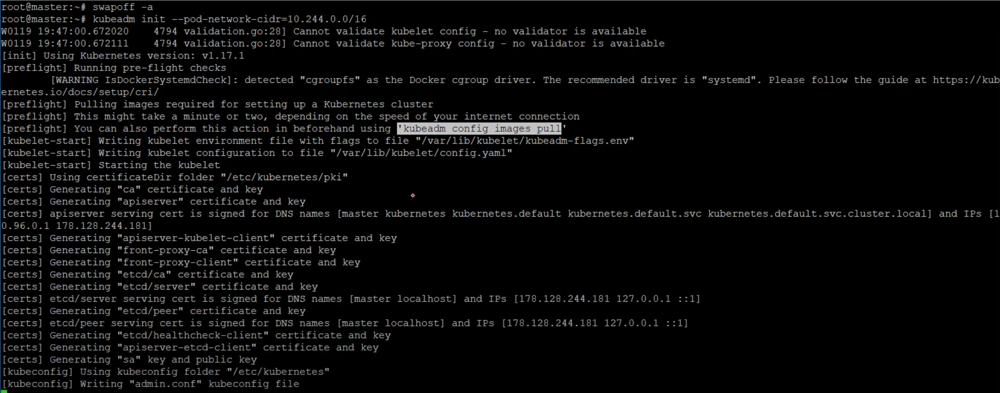
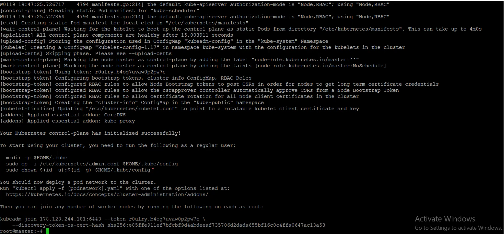
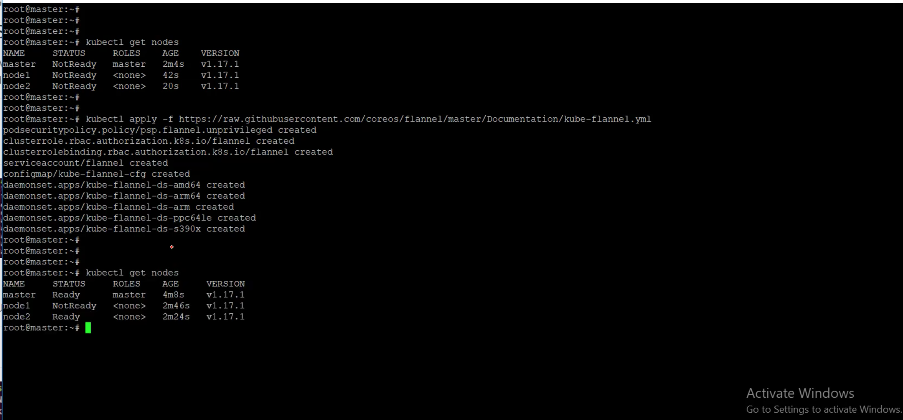
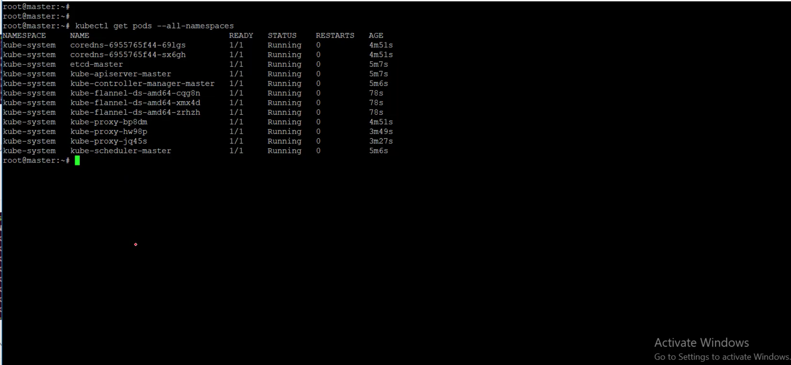
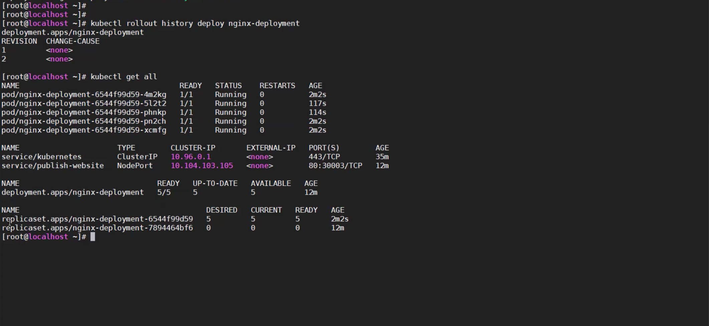
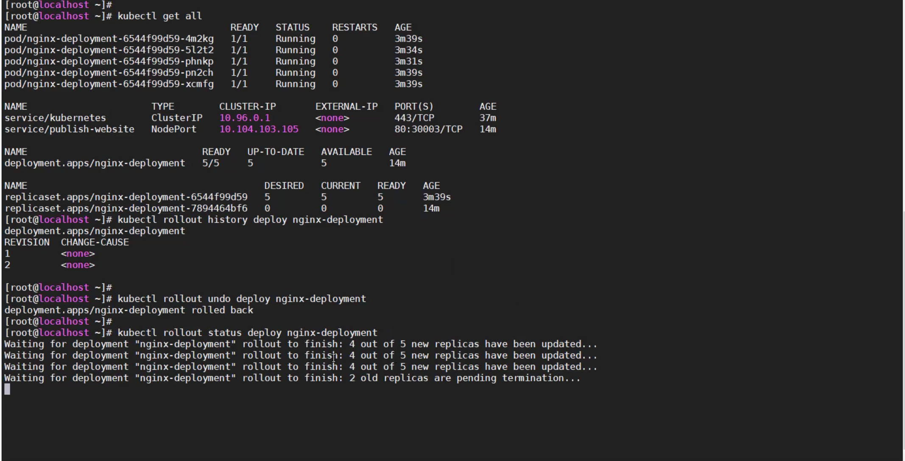
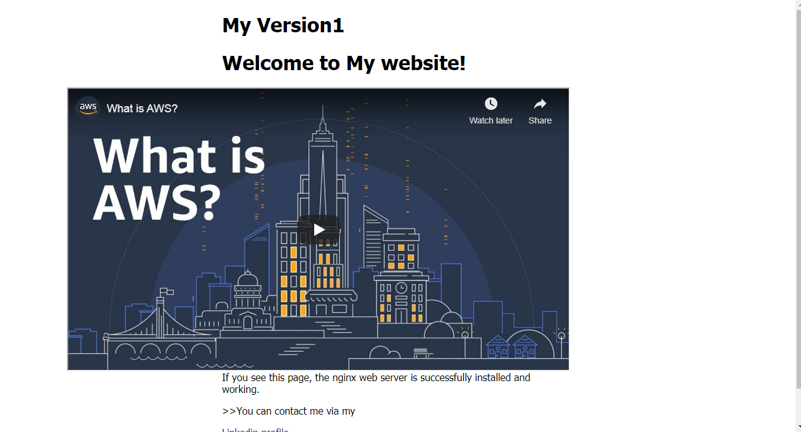
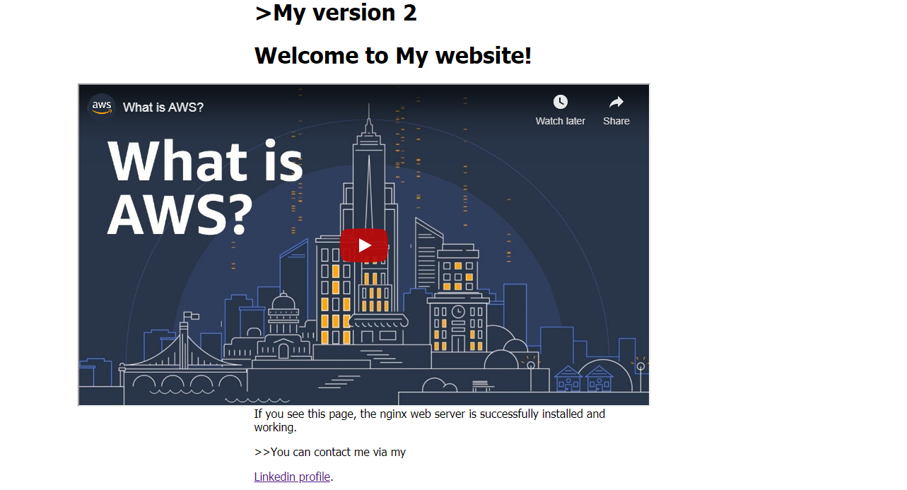

# Kubernetes For CI/CD
##  Project Overview

The purpose of this project was to set up a Kubernetes cluster on Ubuntu VM's to learn the basics of kubectl commands by applying it to my docker images [website hosted on Nginx container](https://hub.docker.com/repository/registry-1.docker.io/samir2296/containerization/tags?page=1) that gives you flexiblity to upgrade and rollback between your image versions easily .

### What are the benefits of using K8S?
K8S is container orchestrator used to automate, configure and scheduling of containers at differnet node. K8S helps that big monolithic legacy applications are being broken down into smaller, independently running components called microservices. 
K8S enables you to change components quickly and as often as necessary to keep up with today’s rapidly changing business requirements.

## Steps to install Kubernetes on Ubuntu:
1- Disable swap memory on both the nodes by running the following command:
 ```
 sudo swapoff -a
 ```

2- Install the Docker utility on both the nodes by running the following command :
 ```
sudo apt install docker.io

 ```
3- Enable Docker on both the nodes:
```
sudo systemctl enable docker
```

4- Run the following command in order to get the Kubernetes signing key:
```
 curl -s https://packages.cloud.google.com/apt/doc/apt-key.gpg | sudo apt-key add
 ```

6- Run the following command on both the nodes in order to add the Xenial Kubernetes repository:
```
sudo apt-add-repository "deb http://apt.kubernetes.io/ kubernetes-xenial main"
```

7- The final step in the installation process is to install Kubeadm on both the nodes through the following command:
```
sudo apt install kubeadm
```
8- Run the following command to initialize Kubernetes on the master node:
```
sudo kubeadm init --pod-network-cidr=10.244.0.0/16
```
9- To start using your cluster, run the following command:
```
mkdir -p $HOME/.kube
```
```
sudo cp -i /etc/kubernetes/admin.conf $HOME/.kube/config

```
```
sudo chown $(id -u):$(id -g) $HOME/.kube/config

```

10- You can now join any number of machines by running the following on each node as root:
```
sudo kubeadm join $controller_private_ip:6443 --token $token --discovery-token-ca-cert-hash $hash
```

11- Deploy a Pod and node Flannel Network through the master node by running the following command:
```
sudo kubectl apply -f https://raw.githubusercontent.com/coreos/flannel/master/Documentation/kube-flannel.yml
```
12- Run the following command to view the status of the network and show the containers of K8S:
```
kubectl get pods --all-namespaces
```
13- Run the following command on master to check the all nodes of cluster:
```
sudo kubectl get nodes
```
## Deployment:
The simplest way to deploy your app from YAML file [kubernetes-deployment-yaml](https://github.com/samir2212/Kubernetes-CICD-Project/blob/master/kubernetes-deployment-yaml) is to use the kubectl create command:
```
kubectl create -f kubernetes-deployment-yaml
```
Run the following command to list all deployments:
```
kubectl get deploy
```
Run the following command to know more information about your deployment process:
```
kubectl describe deploy name-of-your-deployment
```
## Accessing your Applications:
By using your [Kubernetes-service-yaml](https://github.com/samir2212/Kubernetes-CICD-Project/blob/master/Kubernetes-service-yaml) allows the created pods from deployment yaml file to be accessible from outside.

```
kubectl create -f kubernetes-service-yaml
```
Run the following command to list all services:
```
kubectl get svc
```
## Scaling Application:
It is easily to scale your application by changing number of replication in kubernetes-deployment YAML file by running the following command:
```
vim kubernetes-deployment-yaml
```
```
kubectl apply -f kubernetes-deployment-yaml
```
## Upgrading and Rollback Versions:
1-  Run the following command to upgrade your application by changine image in kubernetes-deployment YAML file:
```
vim kubernetes-deployment-yaml
```
```
kubectl apply -f kubernetes-deployment-yaml
```
2- Run the following command to see history of changes made for image version kubernetes-deployment, also the output of this command help you in rollback:
```
kubectl rollout history deploy nginx-deployment
```
3- Run the following command to rollback to older version:
```
kubectl rollout undo deploy nginx-deployment --to-revision=1
```
## Preview










